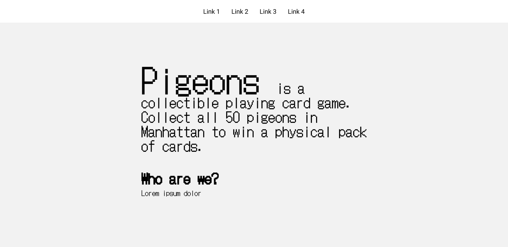
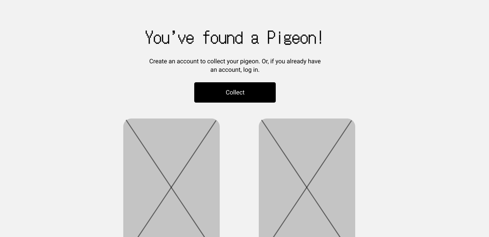
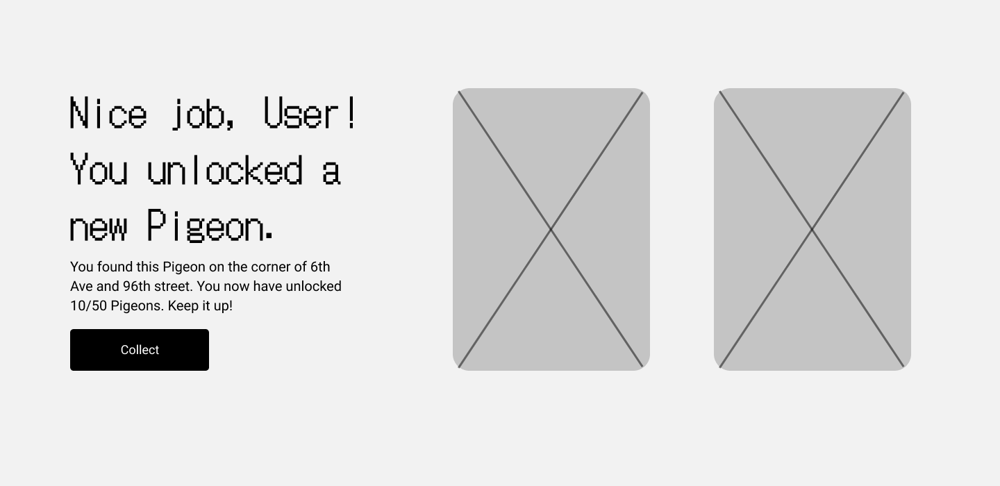
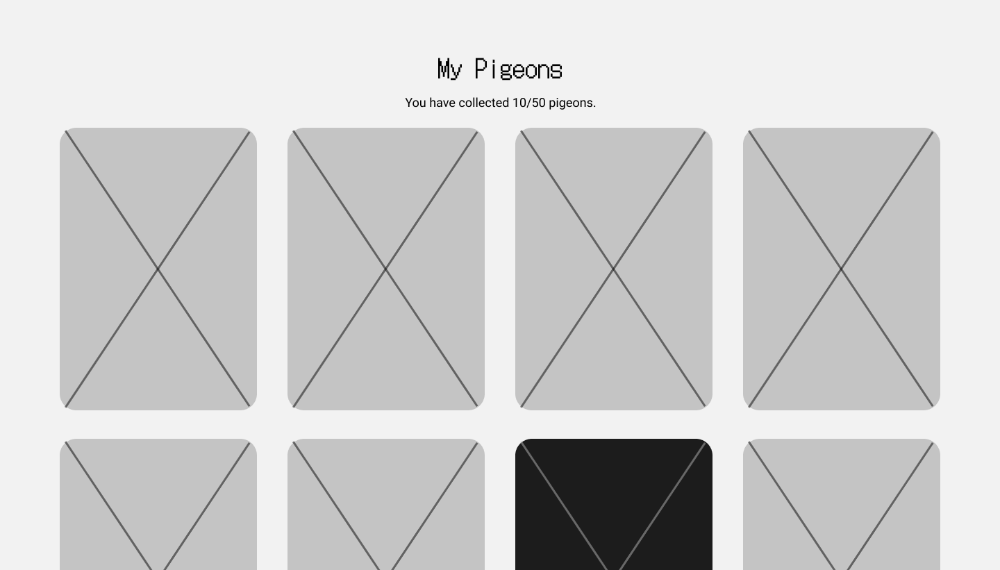
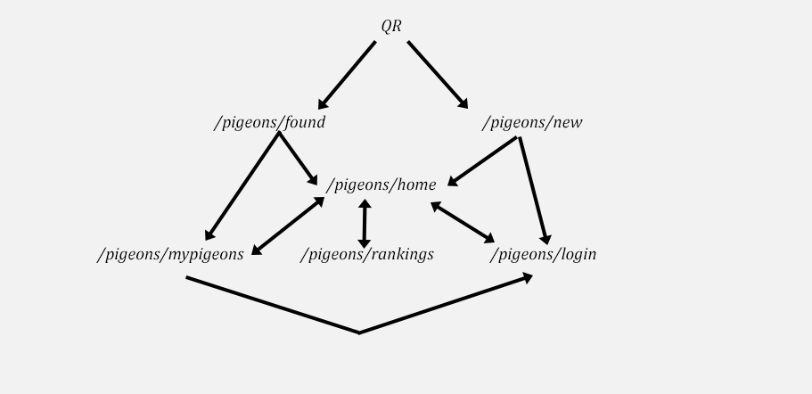

# Pigeons

## Overview

Pigeons is an interactive digital art experience based on a Pigeon collectible playing card game designed by Elias Juul Reichel and Edward Crysz during the London COVID lockdown of 2021. The physical deck of cards detail different types of pigeons (ex., Jesus Pigeon, Hunter Pigeon, Cowboy Pigeon) and their stats. 

Posters of all 50 unique pigeons are posted around the city. Users can scan a QR code and digitally "collect" a playing card. If they collect all 50 cards, they are sent a physical pack of playing cards in the mail. The concept is similar to Pokemon Go and Geocaching.

Scan the following example QR code:


## Data Model

The application will store the "locked" 50 playing cards, and the cards collected by a unique user.

* users can have duplicate cards
* users can trade cards 
* global variable of cards collected, with user rankings

An Example User:

```javascript
{
  username: "pigeonlover",
  hash: // a password hash,
  lists: // an array of references to List collected cards
}
```

An Example List with Embedded Items:

```javascript
{
  user: // a reference to a User object
  cards: [
    { name: "Cowboy Pigeon", quantity: "1", date: "03/24/22"},
    { name: "Matriarch Pigeon", quantity: "2", date: "03/19/22"},
  ],
  createdAt: // timestamp
}
```


## [Link to Commented First Draft Schema](db.js) 

(__TODO__: create a first draft of your Schemas in db.js and link to it_)

## Wireframes

/pigeons/home - homepage for users to read about what the game is



/pigeons/new - page for collecting a pigeon for a new user



/pigeons/found - page for collecting a logged in user



/pigeons/mypigeons - page for showing user's collection of pigeons



/pigeons/rankings - page for showing global rankings


## Site map



## User Stories or Use Cases

1. as non-registered user, I can register a new account with the site
2. as a user, I can log in to the site
3. as a user, I can view my collected pigeons
4. as a user, I can collect pigeons
5. as a user, I can trade pigeons with other users
6. as a user, I can see a geolocational history of my pigeon finds

## Research Topics

(__TODO__: the research topics that you're planning on working on along with their point values... and the total points of research topics listed_)

* (5 points) Integrate user authentication
    * I'm going to be using passport for user authentication
    * And account has been made for testing; I'll email you the password
    * see <code>cs.nyu.edu/~jversoza/ait-final/register</code> for register page
    * see <code>cs.nyu.edu/~jversoza/ait-final/login</code> for login page
* (2 points) Bootstrap
    * used Bootstrap as the CSS framework
* (2 points) SASS
    * used SASS as a CSS preprocessor

8 points total out of 8 required points (___TODO__: addtional points will __not__ count for extra credit_)


## [Link to Initial Main Project File](app.js) 

(__TODO__: create a skeleton Express application with a package.json, app.js, views folder, etc. ... and link to your initial app.js_)

## Annotations / References Used

(__TODO__: list any tutorials/references/etc. that you've based your code off of_)

1. [passport.js authentication docs](http://passportjs.org/docs) - (add link to source code that was based on this)
2. [tutorial on vue.js](https://vuejs.org/v2/guide/) - (add link to source code that was based on this)

